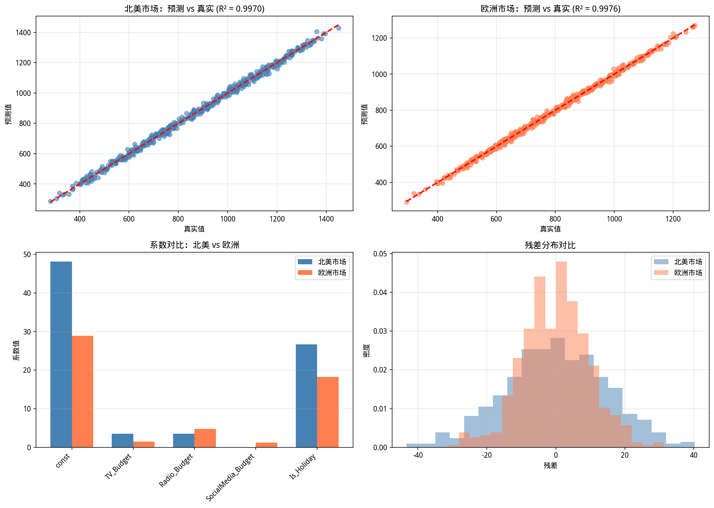

# 场景 B：真实数据与多实例分析报告

## 数据概况

| 指标 | 北美市场 | 欧洲市场 |
|------|----------|----------|
| 样本量 | 500 | 500 |
| 特征数 | 4 | 4 |
| R² | 0.996979 | 0.997607 |

## 模型系数对比

| 变量 | 北美市场系数 | 欧洲市场系数 |
|------|-------------|-------------|
| const | 48.103555 | 28.860515 |
| TV_Budget | 3.507486 | 1.510235 |
| Radio_Budget | 3.497689 | 4.798667 |
| SocialMedia_Budget | 0.002136 | 1.202825 |
| Is_Holiday | 26.699029 | 18.246501 |

## F 检验结果（所有广告变量联合显著性）

### 北美市场
- F 统计量: 40840.760602
- p 值: 0.000000e+00
- 自由度: (4, 495)
- **结论**: ✅ 广告投放策略有效

### 欧洲市场
- F 统计量: 51595.189598
- p 值: 0.000000e+00
- 自由度: (4, 495)
- **结论**: ✅ 广告投放策略有效

## 业务解读

- **北美市场**：广告投放策略对销售额有显著影响（p < 0.05）
- **欧洲市场**：广告投放策略对销售额有显著影响（p < 0.05）

## 可视化

## 总结

- 通过面向对象封装，我们为两个市场创建了独立的模型实例（`model_na` 和 `model_eu`）
- 每个实例独立训练，互不干扰
- F 检验揭示了两个市场广告效果的差异
